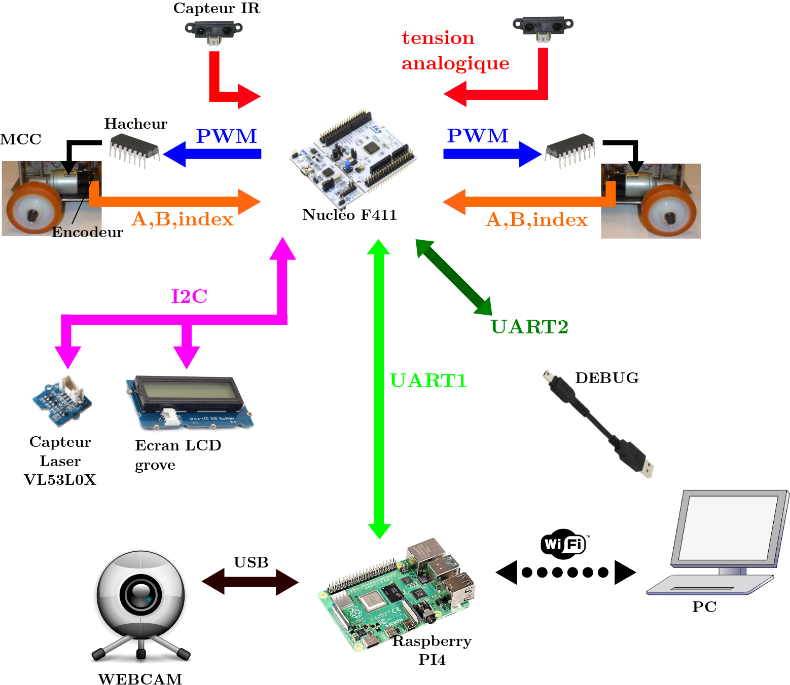
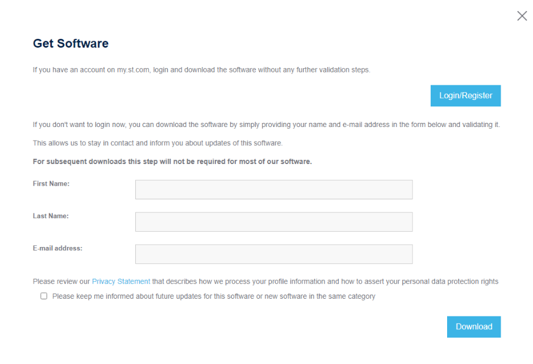
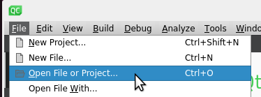
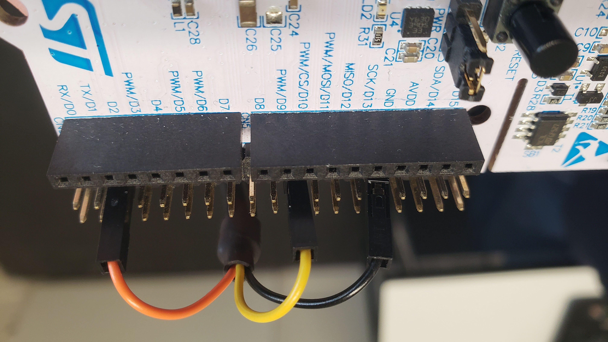
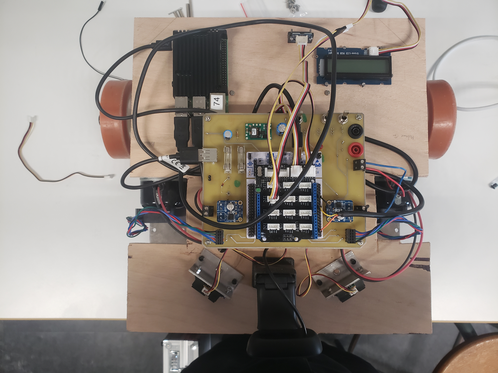

# Mobile robot with ROS2

Project to make a moving robot with communication with ROS2 and sensors
His little name is : Humble

## Project member
- Titouan Melon : https://www.linkedin.com/in/titouan-melon
- Louanne Floch : https://www.linkedin.com/in/louanne-floch
- Jérémy Plantec : https://www.linkedin.com/in/j%C3%A9r%C3%A9my-plantec-7a24a81bb
- Donald TOGNIA DJANKO DIALLO : https://www.linkedin.com/in/tognia-djanko-diallo-donald-b38281228

## Extern links
- Google drive :https://drive.google.com/drive/folders/1ekVw0Pp5evgDc79cSzruJdU0V-NTOiN-?usp=sharing
- Documentation of the mechanical part : https://www.enib.fr/~kerhoas/robot_ros_architecture.html
- Documentation of the STM32 workspace : https://nasmelon.ddns.net/robotRos/doc/index.html
- Visualization of the 3D model : https://nasmelon.ddns.net/robotRos/3d/index.html
- Virtual machine with all software and startup workspace :
 - rapid speed link : 
 - low speed link : https://nasmelon.ddns.net/robotRos/Ubuntu22.04.ova

## Schema


## Folder description

```
\---finalCode
|	\---Camera : camera's program 
|	\---IHM : qt ihm
|	\---WORKSPACE_F411_uROS6 : stm32 workspace
\---startupCode : contain the startup workspace
\---conception
|   \---3D_models
|   \---img : img to readme
|   \---installation scripts
|   \---schematique : eagle
\---docs
|   \---externe : extern pdf 
|   \---html : documentation in web format
|   \---latex : documentation in pdf format
\---report : report for ERI
```

## Summary
1. [Software installation](./README.md#Software-installation-procedure)
2. [Get startup workspace](./README.md#Get-startup-workspace)
3. [Get final workspace](./README.md#Get-final-workspace)
4. [Launch procedure](./README.md#Launch-procedure)
5. [Modify the code](./README.md#modify-code)
6. [Other information](./README.md#Other-information)

# Software installation procedure
## Install OS

### On a PC
Install <a href="https://ubuntu.com/download/desktop" >Ubuntu 22.04.3 LTS</a> on a pc
### On a RPI
Install <a href="https://www.raspberrypi.com/software/">RPI imager</a> and with this install Ubuntu like this

CHOOSE OS -> Other general-purpose OS -> Ubuntu -> Ubuntu Desktop 22.04.03 LTS (64bits)

## Install all in one script
>[!NOTE]
>this section is recommended for a pc but it is possible to apply it to the raspberry PI
>You need 8Go of free space

You can install all necessary tools with this following commands.

```
sudo apt install wget -y
wget https://raw.githubusercontent.com/TitouanMelon/ENIB_Robot_Mobile_Ros2/main/conception/installation%20scripts/ROS.sh
wget STM32cubeIDE.sh
sed -i 's/\r$//' ./ROS.sh && chmod +x ./ROS.sh && ./ROS.sh
```

## For PC and RaspberryPi
### Install ROS2
ROS2 installation is the same on PC and on RPI

```
sudo apt install wget -y
wget https://raw.githubusercontent.com/TitouanMelon/ENIB_Robot_Mobile_Ros2/main/conception/installation%20scripts/ROS_Install.sh
sed -i 's/\r$//' ./ROS_Install.sh && chmod +x ./ROS_Install.sh && ./ROS_Install.sh
```

### Install MicroRos

>[!WARNING]
>Be carreful the installation of microRos require a minimum of 1GB of RAM to succes

>[!NOTE]
>In order to install on a RPI4 with 2GB of RAM you can remove gdm3 install the script with the console and reinstall gdm3

```
sudo apt install wget -y
wget https://raw.githubusercontent.com/TitouanMelon/ENIB_Robot_Mobile_Ros2/main/conception/installation%20scripts/MicroROS_Install.sh
sed -i 's/\r$//' ./MicroROS_Install.sh && chmod +x ./MicroROS_Install.sh && ./MicroROS_Install.sh
```

### Copy scripts on pc
```
cd ~
sudo apt install wget -y
wget https://raw.githubusercontent.com/TitouanMelon/ENIB_Robot_Mobile_Ros2/main/conception/installation%20scripts/STM32.sh
wget https://raw.githubusercontent.com/TitouanMelon/ENIB_Robot_Mobile_Ros2/main/conception/installation%20scripts/SET_ROS_DOMAIN_ID.sh
sed -i 's/\r$//' ./STM32.sh && chmod +x ./STM32.sh
sed -i 's/\r$//' ./SET_ROS_DOMAIN_ID.sh && chmod +x ./SET_ROS_DOMAIN_ID.sh
echo "ROS_DOMAIN_ID=0" | sudo tee -a /etc/environment
sudo ln -s ./STM32.sh /usr/bin/stm32_ros_agent 
sudo ln -s ./SET_ROS_DOMAIN_ID.sh /usr/bin/set_ros_id
```

## For Pc only
>[!NOTE]
>this section is recommended for a pc but it is possible to apply it to the raspberry PI

### STM32CubeIde

Get <a href="https://www.st.com/en/development-tools/stm32cubeide.html">STM32CubeIde</a> and install it 

#### Install

Go to the **Get Software** level and select the latest version of your OS

Next accept the EULA and fil the form with the name of your choice but a valid email address on the next prompt



You will receive an email with the download link

After download just launch the executable and follow the instructions

#### Install gtkterm
```
sudo apt install gtkterm -y
```

### QT creator and QT creator ros
you need to install the qtcreator and qtcreator-ros software

```
sudo apt install qtcreator -y
sudo snap install qtcreator-ros --classic
```

# Get startup workspace
>[!NOTE]
>Be carreful if a directory have the same name the commands can erase the folder

Go to your project directory and run the command below
## Get the STM32 workspace
```
sudo apt install wget unzip -y
wget https://github.com/TitouanMelon/ENIB_Robot_Mobile_Ros2/raw/main/startupCode/WORKSPACE_F411_uROS.zip
unzip WORKSPACE_F411_uROS.zip
```

## Get the qt workspace
```
sudo apt install wget unzip -y
wget https://github.com/TitouanMelon/ENIB_Robot_Mobile_Ros2/raw/main/startupCode/IHM.zip
unzip IHM.zip
```

## Get the camera workspace
>[!NOTE]
>You need to have ROS2 install to follow this tutorial (see [here](./README.md#install-ros2) to install)

For the camera we can't give a startup folder because there are some configuration to do if they want modify the code like add more file
so is easier to follow this links to do the workspace by yourself:

- Tutorial ROS2 humble : https://docs.ros.org/en/humble/Tutorials/Beginner-Client-Libraries/Writing-A-Simple-Py-Publisher-And-Subscriber.html
- Github of the tutorial exemples : https://github.com/ros2/examples/tree/rolling/rclpy

# Get final workspace
```
sudo apt install git -y
git clone https://github.com/TitouanMelon/ENIB_Robot_Mobile_Ros2.git
mkdir -p ~/robot
mv -r ./ENIB_Robot_Mobile_Ros2/finalCode/* ~/robot/
#uncomment to remove git directory
#rm -r ./ENIB_Robot_Mobile_Ros2

```

# Launch procedure
>[!NOTE]
>The command below is make for our final solution so you maybe need to adjust some command to execute your solution

1. Build and run IHM
Open a terminal in the IHM directory and run this command

```
colcon build
source install/setup.bash
./build/robot_mobile_pkg_cpp/my_node_ihm
# if you change the name of project change this line like this ./build/<node_name>/<executable_name>
```

2. Compile, build and run the camera program
```
colcon build --packages-select py_pubsub
source install/setup.bash
ros2 run py_pubsub camera
# if you change the name of project change the line like this ros2 run <package_name> <entry_point>
```

3. Start the STM32.sh or stm32_ros_agent
```
stm32_ros_agent
# or launch STM32.sh from the terminal
```
4. Flash the stm32 and run the code
>[!NOTE]
>If you have the multiple pattern error clean and rebuild the project until the error dissipear

# modify code
## Open stm32 project
>[!NOTE]
>you need STM32CubeIde to follow this tutorial (see [here](./README.md#STM32CubeIde) to install)

- Open stm32cubeIde and select the workspace and select ok

## Open IHM
>[!NOTE]
>you need qtcreator and qtcreator-ros to follow this tutorial (see [here](./README.md#qt-creator-and-qt-creator-ros) to install)

- Open qtcreator-ros
- go to File -> Open project or file


- Open the file 'workspace.user'
- Then close and repeat to make qtcreator-ros load the project files

## Open camera code
1. Code directly on the RPI
2. Use Visual Studio to connect to in ssh to your raspberryPi and have access to his folder 

# Other information
## Documentation of the stm32 final workspace
You can found the documentation of the STM32 project [here](./docs)

## Config camera
```
sudo apt install v412-ctl
v4l2-ctl -d /dev/video0 --all
```

## Get information about ROS2 node and topic 
- You can use rqt to see information about ROS2. It's a visual ihm to see topics and data
- Information about all topic
```
ros2 topic list
```

- Information about a node
```
ros2 node info /nom/du/node
```

## Send and receive data on ros topic
You can see message_type and data on this link : https://docs.ros.org/en/melodic/api/std_msgs/html/index-msg.html

- Publish data once on a topic
```
ros2 topic --once <topic/name> <message_type> <data>
```
- Publish N data per seconds on a topic 
```
ros2 topic -r N <topic/name> <message_type> <data>
```
- exemple of publishing an array of 3 Int8 on the topic camera/hsv_low once ([data format](https://docs.ros.org/en/melodic/api/std_msgs/html/msg/Int8MultiArray.html))
```
ros2 topic pub --once camera/hsv_low std_msgs/msg/Int8MultiArray "{data : [99,91,30]}"
```

- Listen a topic
```
ros2 topic echo <topic/name>
```

## 3D models
see 3D models information [here](./conception/3D_models/)

## Pinout

more information [here](./docs/externe/base_robot.pdf)

| Pin STM32 | Function      | Use             |
|---------- | ------------- | --------------- |
|PA8        | PWM1/1        | Encodeur Voie A |
|PA9        | PWM1/2        | Encodeur Voie B |
|PB10       | EXTI1         | Index encodeur  |
|PA0        | PWM2/1        | Encodeur Voie A |
|PA1        | PWM2/2        | Encodeur Voie B |
|PC0        | EXTI          | Index Moteur    |
|PA6        | PWM3/1        | PWM motor 1     |
|PC7        | PWM3/2        | PWM motor 2     |
|PB3        | ENABLE MOTEUR | actif état Bas  |
|PA4        | ADC1_8        | Sensor IR 1     |
|PB0        | ADC1_4        | Sensor IR 2     |

## Robot cablage


